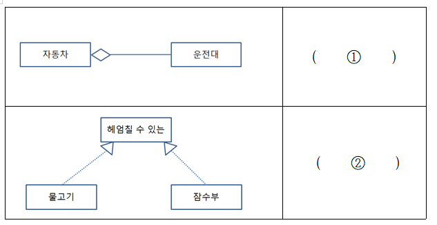

- (         ①        ) Pattern: 전역 변수를 사용하지 않고 객체를 하나만 생성하도록 하며, 생성된 객체를 어디에서든지 참조할 수 있도록 하는 디자인 패턴
- (         ②       ) Pattern: 기존에 구현되어 있는 클래스에 필요한 기능을 추가해 나가는 설계 패턴으로 기능 확장이 필요할 때 객체 간의 결합을 통해 기능을 동적으로 유연하게 확장할 수 있게 해주어 상속의 대안으로 사용하는 디자인 패턴
* 정답) 
① Singleton
② Decorator
---
## 응용 SW 기초 기술 활용
* (        ①        )은/는 FCFS(FIFO)와 라운드 로빈 스케줄링 기법을 혼합한 것으로, 새로운 프로세스는 높은 우선순위를 가지고 프로세스의 실행시간이 길어질수록 점점 낮은 큐로 이동하고 마지막 단계는 라운드 로빈 방식을 적용하는 방식이다.
* (        ②        )은/는 프로세스가 도착하는 시점에 따라 그 당시 가장 작은 서비스 시간을 갖는 프로세스가 종료 시까지 자원을 점유하는 방식이다.
* 정답)

① 다단계 피드백 큐(Multi Level Feedback Queue)

② SJF(Shortest Job First)

---

• (        ①       ) : 테스트 오라클 종류 중 모든 입력값에 대하여 기대하는 결과를 생성함으로써 발생된 오류를 모두 검출할 수 있는 오라클

• (        ②       ) : 테스트 레벨 중 단위 테스트를 통과한 모듈 사이의 인터페이스, 통합된 컴포넌트 간의 상호 작용을 검증하는 테스트 단계

* 정답)

① 참(True) 오라클

② Integration Test

---
* (          ①         ) 공격은 정상 크기보다 큰 ICMP 패킷을 작은 조각(Fragment)으로 쪼개어 공격 대상이 조각화된 패킷을 처리하게 만드는 공격 방법이다.
* (          ②         )은/는 패킷 전송 시 출발지 IP 주소와 목적지 IP 주솟값을 똑같이 만들어서 공격 대상에게 보내는 공격 방법이다.
* 정답)

①. 죽음의 핑(PoD; Ping of Death) 

②. 랜드 어택(Land Attack)
---
25. (        ①        )은/는 소프트웨어 개발을 위한 전체 과정에서 발생하는 모든 항목의 변경 사항을 관리하기 위한 활동이다. 또한, (       ②       )은/는 개발 과정의 각 단계의 산출물을 검토, 평가, 조정, 처리 등 변화를 통제하는 시점의 기준으로 (        ①        )의 대표적인 처리 기준을 제공해준다. 괄호(     ) 안에 들어갈 용어를 쓰시오.
* 정답)

* ①. 형상 관리(Configuration Management) 

* ②. 베이스라인(Baseline)

---

22. EAI는 기업에서 운영되는 서로 다른 플랫폼 및 애플리케이션 간의 정보를 전달, 연계, 통합이 가능하도록 해주는 솔루션이다. EAI 구축 유형 중 단일한 접점의 허브 시스템을 통하여 데이터를 전송하는 중앙 집중식 방식으로 허브 장애 시 전체 인터페이스의 장애를 일으키는 유형은 무엇인가?

* 정답) 허브 앤 스포크(Hub & Spoke)

---


- 직접 연계 방식 중 DB 연결 방식은 수신 시스템의 WAS에서 송신 시스템 DB로 연결하는 DB (         ①       )을/를 생성하고 연계 프로그램에서 해당 DB (         ①       ) 명을 이용하여 연결하는 방식이다.

- (        ②        ) 기법은 데이터베이스에서 자료를 조회하거나 업데이트하기 위해서 자바에서 데이터베이스에 접속할 수 있도록 하는 자바 API이다. 수신 시스템의 프로그램에서 (        ②        ) 드라이버를 이용하여 송신 시스템 DB와 연결할 수 있다.

* 정답)

* ① 커넥션 풀(Connection Pool)

* ② JDBC(Java Database Connectivity)

---

- 어떤 릴레이션에 R이 (          ①         )이고, 릴레이션의 키가 아닌 속성 모두가 R의 어떤 키에도 이행적 함수 종속이 아닐 때 R은 (           ②          )에 속한다.

* 정답)

* ① 2차 정규화(2NF)

* ② 3차 정규화(3NF)

---

19. 다음은 User Interface 설계 도구 및 산출물에 대한 설명이다. 괄호(     ) 안에 들어갈 용어를 쓰시오.

- (        ①        )은/는 디자인, 사용방법설명, 평가 등을 위해 실제 화면과 유사하게 만든 정적인 형태의 모형으로 시각적으로만 구성요소를 배치하는 것으로 일반적으로 실제로 구현되지는 않는다.

- (        ②        )은/는 정책, 프로세스, 콘텐츠 구성, 와이어프레임(UI, UX), 기능 정의, 데이터베이스 연동 등 서비스 구축을 위한 모든 정보가 담겨 있는 설계 산출물이다.

​정답)

① 목업(Mockup)

② 스토리보드(Storyboard)

---



​① 집합 관계(Aggregation) 

② 실체화 관계(Realization)

- 집합 관계는 하나의 사물이 다른 시물에 포함되어 있는 관계를 표현. 표시 형식은 포함되는 쪽에서 포함하는 쪽(전체)으로 빈 마름모로 연결

* 포함 관계는 속이 찬 마름모로 표현

​- 실체화 관계는 사물이 할 수 있거나 해야 하는 기능으로서 서로를 그룹화 할 수 있는 관계(Can do this)를 표현, 기능 쪽으로 빈 점선 화살표 연결

​---

- (           ①        )은/는 최종 사용자인 고객에게 개발 과정에서 정리된 상세 서비스 정보를 포함하여 제품의 수정, 변경, 개선하는 일련의 작업들에 대한 정보를 제공하는 문서이다.
​
- (           ①        ) 작성 항목 중 문서 이름, 제품 이름, 버전 번호, 날짜, 참고 날짜, 버전 등의 정보가 들어가 있는 작성 항목은 ( ​          ②         )이다.

​정답)

① 릴리즈 노트(Release Note)

② 헤더(Header)
​---
- 프로세스 상태전이 중 (          ①         )은/는 준비 상태에 있는 여러 프로세스(Ready List) 중 실행될 프로세스를 선정(Scheduling)하여 CPU를 할당하는 동작을 말한다.
​
- (         ①         )가 수행되면 CPU가 현재 실행하고 있는 프로세스의 문맥 상태를 프로세스 제어블록(PCB)에 저장하고 다음 프로세스의 PCB로 부터 문맥을 복원하는 (         ②         )이/가 발생한다.
​
​정답)

① 디스패치(Dispatch)
​
② 문맥교환(Context switching).
---
15. 다음은 애플리케이션 성능 측정 지표에 대한 설명이다. 괄호(        ) 안에 들어갈 용어을 보기에서 골라 쓰시오.

• (            ①           ) : 애플리케이션에 사용자가 요구를 입력한 시점부터 트랜잭션을 처리 후 그 결과의 출력이 완료할 때까지 걸리는 시간
​
• (            ②           ) : 애플리케이션이 트랜잭션을 처리하는 동안 사용하는 CPU 사용량, 메모리 사용량, 네트워크 사용량을 총칭하는 용어

| 보기 |
Throughput, Response Time, Seek Time, Turnaround Time, Resource Usage, Performance Utility, Access Time
답)
​
①____________________________
​
②____________________________
​
​
​정답)

① Turnaround Time
​
② Resource Usage

​---

- 스니핑(Sniffing)이란 해킹 기법으로서 네트워크 상에서 자신이 아닌 다른 상대방들의 패킷 교환을 훔쳐보는 것을 의미한다.
​
- 스니핑 기법 중 (       ①       )은/는 위조된 매체 접근 제어(MAC) 주소를 지속적으로 네트워크로 흘려보내, 스위치 MAC 주소 테이블의 저장 기능을 혼란시켜 더미 허브(Dummy Hub)처럼 작동하게 하여 네트워크 패킷을 스니핑하는 기법이다.
​
- (       ②       )은/는 공격자가 특정 호스트의 MAC 주소를 자신의 MAC 주소로 위조한 ARP Reply를 만들어 희생자에게 지속적으로 전송하여 희생자의 ARP Cache table에 특정 호스트의 MAC 정보를 공격자의 MAC 정보로 변경, 희생자로부터 특정 호스트로 나가는 패킷을 공격자가 스니핑하는 기법이다.
​
정답)

①. 스위치 재밍(Switch Jamming)

②. ARP 스푸핑(ARP Spoofing)
---
- ( ① )은/는 파라미터가 아닌 모듈 밖에 선언되어 있는 전역 변수를 참조하고 전역 변수를 갱신하는 식으로 상호 작용하는 경우의 결합도이다.
​
- ( ② )은/는 모듈 내에서 한 활동으로부터 나온 출력값을 다른 활동이 사용할 경우의 응집도이다.
​
​정답)

①. 공통 결합도(Common Coupling)
②. 순차적 응집도(Sequential Cohesion)

---

• 관리자가 인사담당자 고길동에게 ‘직원’ 테이블에 대해 INSERT할 수 있는 권한을 부여
• 대소문자를 구분하지 않음
​
정답) GRANT INSERT ON 직원 TO 고길동;
​
---

```printf("%.2f", (float)21/(3*2));```

* 3.50

---

10. 안전한 인터페이스를 구현하기 위해서는 보안 기술 적용이 무엇보다도 중요하다. 다음은 인터페이스 보안 구현 방안이다. 괄호(       ) 안에 들어갈 용어를 쓰시오.

- 중요 데이터가 보관된 데이터베이스는 암호화를 필수적으로 적용해야 한다. 데이터베이스 암호화 방식 중 (       ①       )은/는 암·복호화 모듈이 DB 서버에 설치된 방식으로 DB 서버에 암·복호화, 정책 관리, 키 관리 등의 부하가 발생한다.
​
- 또한 전송계층(4계층)과 응용계층(7계층) 사이에서 클라이언트와 서버 간의 웹 데이터 암호화(기밀성), 상호 인증 및 전송 시 데이터 무결성을 보장, 443포트를 사용하는 보안 프로토콜인 (       ②       )을/를 사용해서 중요 인터페이스 데이터의 안전한 전송을 수행해야 한다.
답)
​①____________________________
​
​②____________________________
​
​
​정답)
① Plug-in (방식)
② SSL/TLS (= SSL = TLS)
​---
- (             )은/는 컴퓨터 네트워크를 경유하는 프로세스 간 통신의 종착점이다. 


- OSI 7 계층의 애플리케이션 계층(application layer)에 존재하는 네트워크 응용 프로그램들은 데이터를 송수신하기 위해 (             )을/를 거쳐 전송 계층(trasport layer)의 통신망으로 전달함으로써 데이터를 송수신하게 된다.
​

답)__________________________
​

​정답) 소켓(socket)

​---

30. 다음은 클래스 다이어그램(Class Diagram)에 대한 설명이다. 괄호(      ) 안에 들어갈 용어를 쓰시오.

- 클래스 다이어그램의 구성 요소 중 (          ①         ) 은/는 클래스의 구조적 특성에 이름을 붙인 것으로 특성에 해당하는 인스턴스가 보유할 수 있는 값의 범위를 기술한 것이다.

​

​​- 클래스 다이어그램의 접근 제어자 중 (​      ②      )은/는 동일 패키지/파생 클래스에서 접근 가능(protected)함을 표현할 때 사용한다.

정답) 

​​① 속성(Attribute)

​​② #

​---

1. 다음에서 설명하는 시스템은 무엇인가?

- 비정상적인 접근의 탐지를 위해 의도적으로 설치해 둔 시스템

- 침입자를 속여 실제 공격당하는 것처럼 보여줌으로써 크래커를 추적하고, 공격기법의 정보를 수집하는 역할을 하는 시스템

​
답)_____________________________________
​
​
​
​정답) ​허니팟(Honeypot) : 허니팟 또는 허니 포트는 비정상적인 접근을 탐지하기 위해 의도적으로 설치해 둔 시스템을 의미한다.
​​
​
해설) 2022년 1회 필기 교차 출제 대비
​---
2. 다음은 테스트에 대한 설명이다. 괄호(     ) 안에 들어갈 테스트의 유형을 보기에서 골라 쓰시오.
• (      ①      ) : 오류를 제거하거나 수정한 시스템에서 오류 제거와 수정에 의해 새로이 유입된 오류가 없는지 확인하는 일종의 반복 테스트 기법
• (      ②      ) : 짧은 시간에 사용자가 몰릴 때 시스템의 반응을 측정하는 테스트 기법
| 보기 |
Recovery Testing, Security Testing, Generalization, Structure Testing, Regression Testing, Stress Testing, Spike Testing
정답)
① Regression Testing
② Spike Testing
---
3. 아래는 상호배제를 해결하기 위한 기법이다. 괄호(        ) 안에 들어갈 용어를 쓰시오.
• (                )은/는 멀티프로그래밍 환경에서 공유 자원에 대한 접근을 제한하는 기법이다.
• 한 프로세스(또는 스레드)에서 (             )의 값을 변경하는 동안 다른 프로세스가 동시에 이 값을 변경해서는 안 된다.
• (                )은/는 P, V 연산을 기반으로 구현한다.
​
정답) 세마포어 (Semaphore)
​
​해설) 
* 2022년 1회 기사 필기 기출, 2022년 1회 산업기사 필기 기출
* 세마포어 문제가 기사, 산업기사 필기에 출제 되었기 때문에 나올 가능성이 많습니다. 잘 알아두시면 좋겠습니다.
* 한글, 영어 모두 알아두시구요. 세마포어가 상호배제를 해결하기 위한 기법이라는 것과 세마포어의 개념을 알아두세요.
---
4. 아래는 저작권 관리 구성요소에 대한 설명이다. 각각이 설명하는 저작권 관리 구성 요소를 쓰시오.
① 저작권에 대한 사용 권한, 라이센스 발급, 사용량 관리 및 키 관리, 라이센서 발급 관리 등을 수행하는 도구
② 콘텐츠를 메타데이터와 함께 배포 가능한 단위로 묶는 도구
답)
①_________________________
②_________________________
​
​
​
정답)
① 클리어링 하우스(Clearing House)
② 패키저(Packager)

​---

5. 상향식 비용 산정 기법 중 소프트웨어 각 기능의 원시 코드 라인 수의 낙관치, 중간치, 비관치를 측정하여 예측치를 구하고 이를 이용하여 비용을 산정하는 기법을 무엇이라고 하는지 쓰시오.
​
​
​
정답) LOC(Lines of Code) 기법

---

7. 다음은 UML의 관계(Relationships)에 대한 설명이다. 괄호(       ) 안에 공통적으로 들어갈 용어를 쓰시오.

• (              ) 관계는 하나의 객체에 여러 개의 독립적인 객체들이 구성되는 관계이다.

• (              ) 관계는 하나의 사물이 다른 사물에 포함되어 있는 관계를 표현한다.

• (              ) 관계는 포함되는 쪽(Part; 부분)에서 포함하는 쪽(Whole; 전체)으로 속이 빈 마름모를 연결하여 표현한다.
​
​정답) 집합(Aggregation)

---

6. 최근 클라우드 기반의 대용량 데이터를 다루는 기술이 다양하게 활용되고 있다. 아래는 클라우드와 빅데이터 관련 기술에 대한 설명이다. 괄호(      ) 안에 들어갈 용어를 쓰시오.

• (       ①      )은/는 컨테이너 응용 프로그램의 배포를 자동화하는 오픈소스 엔진으로 소프트웨어 컨테이너 안에 응용 프로그램들을 배치시키는 일을 자동화해 주는 오픈 소스 프로젝트이자 소프트웨어이다.
​
• (       ②      )은/는 웹 사이트를 크롤링하여 구조화된 데이터를 수집하는 파이썬(Python) 기반의 애플리케이션 프레임워크이다. 
정답)

① 도커(Docker)

② 스크레파이Scrapy

---

8. 다음은 반 정규화 기법에 대한 설명이다. 괄호(        ) 안에 들어갈 용어를 쓰시오.

• 테이블 분할 기법 중 집계 테이블 추가는 집계 데이터를 위한 테이블을 생성하고, 각 원본 테이블에 트리거를 설정하여 사용하는 것으로, 트리거의 오버헤드에 유의할 필요가 있다.
​
• 테이블 분할 기법 중 (                ) 추가는 이력 관리 등의 목적으로 추가하는 테이블로, 적절한 데이터양의 유지와 활용도를 높이기 위해 기본키를 적절히 설정한다.
​
정답) 진행 테이블

---

9. 다음은 IPC(Inter-Process Communication) 주요 기법에 대한 설명이다. 괄호(       ) 안에 공통적으로 들어갈 용어를 쓰시오.

- (             )은/는 컴퓨터 네트워크를 경유하는 프로세스 간 통신의 종착점이다. 

- OSI 7 계층의 애플리케이션 계층(application layer)에 존재하는 네트워크 응용 프로그램들은 데이터를 송수신하기 위해 (             )을/를 거쳐 전송 계층(trasport layer)의 통신망으로 전달함으로써 데이터를 송수신하게 된다.
​
답)__________________________
​
​
​
​정답) 소켓(socket)
​
---

10. 안전한 인터페이스를 구현하기 위해서는 보안 기술 적용이 무엇보다도 중요하다. 다음은 인터페이스 보안 구현 방안이다. 괄호(       ) 안에 들어갈 용어를 쓰시오.

- 중요 데이터가 보관된 데이터베이스는 암호화를 필수적으로 적용해야 한다. 데이터베이스 암호화 방식 중 (       ①       )은/는 암·복호화 모듈이 DB 서버에 설치된 방식으로 DB 서버에 암·복호화, 정책 관리, 키 관리 등의 부하가 발생한다.
​
- 또한 전송계층(4계층)과 응용계층(7계층) 사이에서 클라이언트와 서버 간의 웹 데이터 암호화(기밀성), 상호 인증 및 전송 시 데이터 무결성을 보장, 443포트를 사용하는 보안 프로토콜인 (       ②       )을/를 사용해서 중요 인터페이스 데이터의 안전한 전송을 수행해야 한다.

답)

​①____________________________
​
​②____________________________
​
​
​정답)
① Plug-in (방식)
② SSL/TLS (= SSL = TLS)
​---
32. 다음에서 설명하는 IT 기술을 쓰시오.

- 기존의 라우터, 스위치 등과 같이 하드웨어에 의존하는 네트워크 체계에서 안정성, 속도, 보안 등을 소포트웨어로 제어, 관리하기 위해 개발된 기술

- 네트워크를 제어부, 데이터 전달부로 분리하여 네트워크 관리자가 보다 효율적으로 네트워크를 제어, 관리 할 수 있는 기술

- 네트워크 장비의 펌웨어 업그레이드를 통해 사용자의 직접적인 데이터 전송 경로 관리가 가능하고, 기존 네트워크에는 영향을 주지 않으면서 특정 서비스의 전송 경로 수정을 통하여 인터넷상에서 발생하는 문제를 처리할 수 있음

​

​정답) SDN(Software Defined Networking)
---
31. 다음은 논리적 데이터 모델링 유형에 대한 설명이다. 괄호(      ) 안에 들어갈 용어를 쓰시오.

- (         ①        )모델은 논리적 구조가 2차원 테이블 형태로 구성된 모델로 1:1, 1:N, N:M을 자유롭게 표현할 수 있다.

​

​​- (​         ②        )모델은 논리적 구조가 트리 형태로 구성된 모델로 상하관계 존재하고, 1:N 관계만 허용한다.

정답) 

​​① 관계 데이터

​

​​② 계층 데이터
---
33. 다음은 정보보안과 관련된 내용이다. 괄호(      ) 안에 들어갈 용어를 쓰시오.

- 정보보안 3요소 중에서 (       ①     )은/는 인가된 사용자에 대해서만 자원 접근이 가능해야 하는 특성이다.

- 기업에서는 (        ①       )을/를 구현하기 위해서 다양한 보안 장비 및 유틸리티를 사용한다.

- 대표적인 유틸리티인 (        ②      )은/는 어떤 외부 컴퓨터가 접속되면 접속 인가 여부를 점검해서 인가된 경우에는 접속이 허용되고, 그 반대의 경우에는 거부할 수 있는 접근제어 유틸리티이다.

​​정답) 

① 기밀성(Confidentiality)

​​​​② TCP 레퍼(TCP Wrapper)

​---

