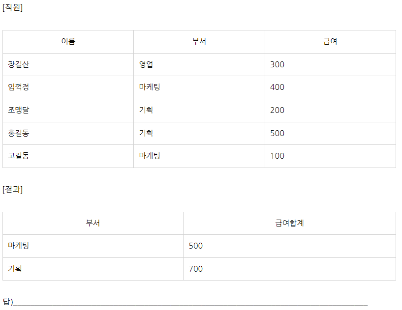
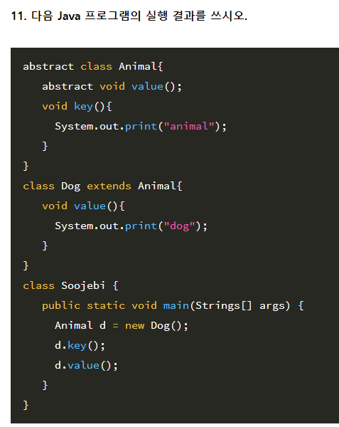
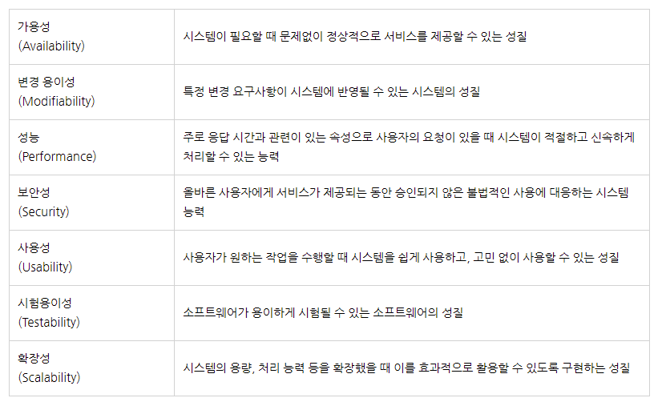
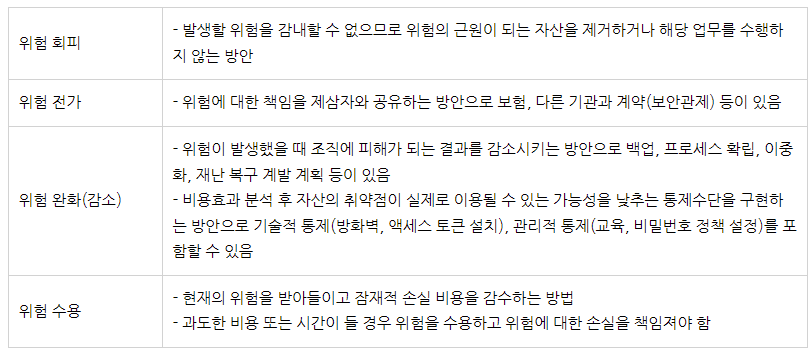

# [2022년 제2회 기사 실기 출제예상 문제]

## (1과목) 요구사항 확인 - 1 다음은 소프트웨어 개발 방법론에 대한 설명이다. 괄호(       ) 안에 들어갈 소프트웨어 개발 방법론 유형을 쓰시오

- (          ①          ) 방법론은  개발과 함께 즉시 피드백을 받아서 유동적으로 개발하고 절차보다는 사람이 중심이 되어 변화에 유연한  방법론이다.
- (          ②          ) 모델은 소프트웨어 개발 시 각 단계를 확실히 마무리 지은 후에 다음 단계로 넘어가는 소프트웨어 생명주기 모델이다.
- (          ③          ) 모델은 시스템 개발 시 위험을 최소화하기 위해 점진적으로 완벽한 시스템으로 개발해 나가는 모델이다.

정  답)

① 애자일(Agile) : 즉시피드백, 유동적 개발, 절차보다는 사람 중심

 ② 폭포수(Waterfall) : 단계별 마무리 후 다음 단계

③ 나선형(Spiral) : 위험 최소화 점짐전으로 완벽한 시스템

---

## (확장) 보안기사 응용 문제 - 2 다음은 보안 시스템에 대한 설명이다. 괄호(     ) 안에 들어갈 용어를 쓰시오

- (___)은/는 결제자의 다양한 정보를 수집해 패턴을 만든 후 패턴과 다른 이상 결제를 잡아내고 결제 경로를 차단하는 보안 시스템으로, 보안 솔루션에 의존하던 기존 보안과 달리 빅데이터를 바탕으로 적극적인 보안 개입을 하는 것이 특징이다.

: 다양한 정보 기반 패턴 생성 후 패턴과 다른 이상 결제를 잡아내고 차단하는 보안 시스템, 빅데이터 바탕 보안 개입.

정답) 이상 행위 탐지 시스템(FDS; Fraud Detection System)

Fraud : 사기 프로드

---

### 해설

- FDS는 전자금융거래 시 단말기 정보와 접속 정보, 거래 정보 등을 수집하고 분석해 의심스러운 거래나 평소와 같지 않은 금융 거래가 발생하면 이를 차단하는 시스템이다.

- FDS는 빅데이터를 기반으로 작동하는데 수집한 빅데이터를 바탕으로 종합적으로 분석하여 다양한 조건, 위험 점수 등을 매겨 위험 정도에 따라 본인 확인·재인증·거래 중지 등의 조치를 한다.

---

## (확장) 보안기사 응용 문제 - 3 다음은 데이터 비식별화 처리기법에 대한 설명이다. 괄호(      ) 안에 들어갈 처리 기법을 보기에서 골라 쓰시오

- (         ①        ) : 개인 식별이 가능한 데이터에 대하여 직접 식별할 수 없는 다른 값으로 대체하는 기법으로 그 자체로 완전 비식별화가 가능하며 데이터의 변형, 변질 수준이 낮음
- (         ②        ) : 개인정보에 대하여 통곗값을 적용하여 특정 개인을 판단할 수 없도록 하는 기법

| 보기 |

가명처리(Pseudonymisation), 총계처리(Aggregation), 데이터 값 삭제(Data Reduction), 범주화(Data Suppression), 데이터 마스킹(Data Masking), K-익명성(k-anonymity), l-다양성(l-diversity), t-근접성(t-closeness)

정답)

① 가명처리(Pseudonymisation) : 다른값으로 대체

 ② 총계처리(Aggregation) : 통곗값을 적용 특정 개인 판단을 할 수 없게

---

### 해설)

가명처리(Pseudonymisation)

- 개인 식별이 가능한 데이터에 대하여 직접 식별할 수 없는 다른 값으로 대체하는 기법

총계처리(Aggregation)

- 개인정보에 대하여 통곗값을 적용하여 특정 개인을 판단할 수 없도록 하는 기법

데이터 값 삭제(Data Reduction)

- 개인정보 식별이 가능한 특정 데이터 값을 삭제 처리하는 기법

범주화(Data Suppression)

- 단일 식별 정보를 해당 그룹의 대표값으로 변환(범주화)하거나 구간 값으로 변환(범위화)하여 고유 정보의 추적 및 식별을 방지하는 기법

데이터 마스킹(Data Masking)

- 개인 식별 정보에 대하여 전체 또는 부분적으로 대체값(공백, ‘*’, 노이즈 등)으로 변환하는 기법

---

## (2과목) 화면 설계 - 4 UML 다이어그램에 대한 설명이다. 괄호(       ) 안에 들어갈 UML 다이어그램의 유형을 쓰시오

- (          ①          ) 다이어그램은   컴포넌트 사이의 종속성을 표현하고, 결과물, 프로세스, 컴포넌트 등 물리적 요소들의 위치를 표현하는 다이어그램이다.
- (          ②          ) 다이어그램은 객체 상태 변화와 시간 제약을 명시적으로 표현하는 다이어그램이다.

정답)

① 배치(Deployment) : 컴포넌트 사이 종속성 표현, 결과,프로,컴포 등 물리적 요소들의 위치를 표현하는 다이어그램이다.

② 타이밍(Timing) : 객체 상태 변화, 시간 제약을 명시적 표현

---

## (6과목) 프로그래밍 활용 - 5 다음 자바 프로그램 결과를 쓰시오

```java
public class Soojebi
{
    // isPrime 메소드는 Prime number 이면 1, 아니면 0을 리턴한다.
    public static int isPrime(int num){
        for(int i=2 ; i<num ; i++){
            if(num%i == 0){
                return 0;
            }
        }
        return 1;
    }
    
  public static void main(String[] args) {
    int num=100, 
        cnt=0;
    for(int i=2 ; i<num ; i++){     // i가 2부터 num보다 작을 떄 까지 반복 
        // i = 2~99

        cnt = cnt + isPrime(i);  //오른쪽 cnt에 isPrime의 결과를 더하여 왼쪽 cnt에 대입한다.
    }
    
    System.out.println(cnt);   // cnt 를 화면에 출력한다.
  }
}

```

정답 25

### 해설)  isPrime 메소드는 Prime number 이면 1, 아니면 0을 리턴한다

main 함수는 2부터 99까지 숫자 중에서 소수의 갯수를 구하고 화면에 출력한다.

Prime number 는 '%' 를 알고 있다면 어렵지 않게 푸실수 있습니다!

%를 활용하는 문제 유형들을 정리해 놓으세요!

---

## (3과목) 데이터 입출력 구현 - 6. 다음은 관계 데이터 모델의 구성요소에 대한 설명이다. 괄호(       ) 안에 들어갈 구성요소를 쓰시오

- (          ①          ) : 튜플(Row)의 수
- (          ②          ) : 애트리뷰트(Column)의 수
- (          ③          ) : 정의된 스키마에 따라 생성된 테이블에 실제 저장된 데이터의 집합

정답)

①  카디널리티(Cardinality)

② 차수(Degree)

③ 인스턴스(Instance)

---

## (9과목) 소프트웨어 개발 보안 구축 - 7. 다음은 악성 프로그램에 대한 설명이다. 괄호(       ) 안에 들어갈 용어를 영문 Full-name으로 쓰시오

- (          ①          )은/는 한 시스템에서 다른 시스템으로 전파하기 위해서 사람이나 도구의 도움이 필요한 악성 프로그램이다.
- (          ②          )은/는 스스로를 복제하여 네트워크 등의 연결을 통하여 전파하는 악성 소프트웨어 컴퓨터 프로그램이다.
- (          ③          )은/는 합법적 프로그램 안에 내장된 코드로서 특정한 조건이 만족하였을 때 작동하는 악성 코드이다.

정  답)

①  Virus

② Worm

③ Logic Bomb

보안기사 기출 문제입니다. 개념을 잘 익혀두세요.

---

## (4과목) 통합 구현 - 8. 다음은 운영체제에서 프로세스 간 서로 데이터를 주고받기 위한 통신 기술인 IPC 주요 기법들에 대한 설명이다. 괄호(      ) 안에 들어갈 용어를 쓰시오

- (         ①         )은/는 메시지가 발생하면 메모리 공간을 이용하여 메세지를 전달하는 통신 방식으로 FIFO 정책으로 데이터가 전송된다. (         ①         )은/는 메시지 또는 패킷 단위로 동작하는 프로세스 간 통신 방법이다.

- 프로세스간 메시지 전송을 하거나, 메모리 공유를 통해서 특정 데이터를 공유하게 될 때 공유된 자원에 여러 개의 프로세스가 동시에 접근하면 안되며, 한번에 하나의 프로세스만 접근 가능하도록 해야 하기 때문에 (        ②        )을/를 사용하여 상호배제를 구현해야 한다.

정  답)

① 메세지 큐(Message Queue)

② 세마포어(Semaphore)

해설)  2022 수제비 정보처리기사 실기책 4-31페이지

- 추가 내용 포함해서 작성했습니다.

---

## (7과목) SQL 응용 - 9


9. 다음 중 [직원] 테이블에서 부서별로 그룹을 묶었을 때 부서의 급여합계가 500 이상인 부서, 해당 부서의 급여합계를 출력하는 구하는 쿼리를 작성하시오.




 정답)

SELECT 부서, SUM(급여) AS 급여합계 FROM 직원 GROUP BY 부서 HAVING SUM(급여) >= 500;

또는,

SELECT 부서, SUM(급여) AS 급여합계 FROM 직원 GROUP BY 부서 HAVING 급여합계 >= 500;


---

## (5과목) 인터페이스 구현 - 10


10. 다음은 인터페이스 시스템에 대한 내용이다. 괄호(      ) 안에 들어갈 용어를 쓰시오

- A은행과 B은행은 마이데이터 법에 따라서 사용자 거래 내역을 공유하는 인터페이스 시스템을 구축하였다.


- 외부, 내부 모듈 연계는 (        ①        ) 방식을 통해 은행에서 운영되는 서로 다른 플랫폼 및 애플리케이션들 간을 하나의 시스템으로 관리 운영할 수 있도록 서비스 중심의 통합을 지향하도록 했고,

- 속성-값(Attribute-Value Pair) 쌍 또는 “키-값 쌍”으로 이루어진 데이터 오브젝트를 전달하기 위해 인간이 읽을 수 있는 텍스트를 사용하는 개방형 표준 포맷인 (                   ②          )을/를 사용하여 구축하였다.


- 또한 상호간 거래 내역 데이터를 전송할 때에는 반드시 IP 계층(3계층)에서 무결성과 인증을 보장하는 인증 헤더(AH)와 기밀성을 보장하는 암호화(ESP)를 이용하여 양 종단 간(End Point) 구간에 대한 보안 서비스를 제공하는 터널링 프로토콜인 (          ③          )을/를 사용하도록 시스템을 구축하였다.


정답) 


① ESB

② JSON

③ IPSec


  


---

### 해설)  2022 수제비 정보처리기사 실기책 5-8페이지부터~




정답) animaldog


---

## (11과목) 응용 SW 기초 기술 활용 - 12


12. 다음에서 설명하는 프로토콜은 무엇인가?

- 비트(Bit) 위주의 프로토콜로, 각 프레임에 데이터 흐름을 제어하고 오류를 보정할 수 있는 비트 열을 삽입하여 전송하는 역할하는 프로토콜

- 상단방향, 반이중, 전이중 통신을 모두 지원하고 오류 제어를 위해 Go-Back-N ARQ 방식을 사용

- 점대점 방식이나 다중방식의 통신에 사용되는 동기식 비트 중심의 데이터 링크 프로토콜

답)_________________________________


정답) HDLC(High-level Data Link Control)  프로토콜


해설) 2022 수제비 정보처리기사 실기책 11-36페이지


* 2022년 제3회 정보처리산업기사 기출 문제 응용 출제


---

## (1과목) 요구사항 확인 - 13


13. 다음은 소프트웨어 아키텍처의 시스템 품질 속성에 대한 설명이다. 괄호(      ) 안에 들어갈 품질 속성을 쓰시오

- (         ①         )은/는 사용자가 원하는 작업을 수행할 때 시스템을 쉽게 사용하고, 고민 없이 사용할 수 있는 편의성이다.


- (         ②         )은/는 주로 응답 시간과 관련이 있는 속성으로 사용자의 요청이 있을 때 시스템이 적절하고 신속하게 처리할 수 있는 능력이다.


정  답)


 ① 사용성(Usability)


② 성능(Performance)
해설)  SW 아키텍처의 시스템 품질 속성은 가용성, 변경 용이성, 성능, 보안성, 사용성, 시험용이성, 확장성이 있다. (2022년도 제3회 정처산기 필기 기출 변형 문제)


#### 가용성(Availability)

: 시스템이 필요할 때 문제없이 정상적으로 서비스를 제공할 수 있는 성질

#### 변경 용이성(Modifiability)

: 특정 변경 요구사항이 시스템에 반영될 수 있는 시스템의 성질

#### 성능(Performance)

: 주로 응답 시간과 관련이 있는 속성으로 사용자의 요청이 있을 때 시스템이 적절하고 신속하게 처리할 수 있는 능력

#### 보안성(Security)

올바른 사용자에게 서비스가 제공되는 동안 승인되지 않은 불법적인 사용에 대응하는 시스템 능력

#### 사용성(Usability)

사용자가 원하는 작업을 수행할 때 시스템을 쉽게 사용하고, 고민 없이 사용할 수 있는 성질

#### 시험용이성(Testability)

소프트웨어가 용이하게 시험될 수 있는 소프트웨어의 성질

#### 확장성(Scalability)

시스템의 용량, 처리 능력 등을 확장했을 때 이를 효과적으로 활용할 수 있도록 구현하는 성질




---

## (10과목) 애플리케이션 테스트 관리 - 14


14. 다음은 테스트 관련 용어이다. 괄호(      ) 안에 들어갈 용어을 보기에서 골라 쓰시오

- (        ①       )은/는 결정 조건 내 모든 개별 조건식의 모든 가능한 조합을 100% 보장하는 테스트 커버리지로 기본 조건식의 가능한 논리적인 조합이 적어도 한 번은 테스트되도록 테스트 케이스를 도출한다.


- (        ②       )은/는 수행 가능한 모든 경로를 테스트하는 기법으로 맥케이브의 순환복잡도를 기반으로 커버리지를 계산한다.

| 보기 |

Branch Coverage, Multiple Condition Coverage, Condition Coverage, Modified Condition/Decision Coverag, Control Flow Testing, Base Path Coverage, Statement Coverage, Data Flolw Testing, Equivalence Partitioning Testing, Decision Table Testing, State Transition Testing

정답)


① Multiple Condition Coverage


② Base Path Coverage


---

## (9과목) 소프트웨어 개발 보안 구축 - 15


15. 다음은 네트워크 보안 공격이다. 괄호(      ) 안에 들어갈 용어를 쓰시오

- (         ①        )은/는 TCP 연결 설정을 위한 3-way handshaking과정에서 half-open 연결 시도가 가능하다는 취약성을 이용하는 공격 방식이다.


- (         ②       )은/는 서버와 클라이언트가 TCP 통신을 하고 있을 때, RST 패킷을 보내고 시퀀스 넘버 등을 조작하여 연결을 가로채는 공격 방식이다.


- (         ③       )은/는 IP 패킷의 재조합 과정에서 잘못된 Fragment Offset 정보로 인해 수신시스템이 문제를 발생하도록 만드는 DoS 공격이다.

정답)


① SYN 플러딩(SYN Flooding)


 ② 세션 하이재킹(Session Hijacking)

  

③ 티어 드롭(Tear Drop)


---

## (11과목) 응용 SW 기초 기술 활용 - 16


6. 다음은 IT 기술에 대한 설명이다. 괄호( ) 안에 들어갈 용어를 쓰시오

 - ( ① )은/는 네트워크를 제어부(Control Plane), 데이터 전달부(Data Plane)로 분리하여 네트워크 관리자가 보다 효율적으로 네트워크를 제어, 관리할 수 있는 기술이다. 기존의 라우터, 스위치 등과 같이 하드웨어에 의존하는 네트워크 체계에서 안정성, 속도, 보안 등을 소프트웨어로 제어, 관리하기 위해 개발되었다.


- ( ② )은/는 범용 하드웨어(서버/스토리지/스위치)에 가상화 기술을 적용하여 네트워크 기능을 가상 기능으로 모듈 화하여 필요한 곳에 제공(스위치, 라우터 등)하는 기술이다.

정답)


① SDN(Software Defined Networking)


 ② NFV(Network Function Virtualization)


---

## (9과목) 소프트웨어 개발 보안 구축 - 17


17. 다음은 정보보안 위험의 처리 방식에 대한 설명이다. 괄호(       ) 안에 들어갈 위험 처리 방안을 쓰시오

- (        ①        )은/는 사업 목적상 위험을 처리하는 데 들어가는 과도한 비용 또는 시간으로 인해 일정 수준의 위험을 받아 들이는 방법으로 그 위험이 조직에 발생시키는 결과에 대한 책임을 관리층이 지는 방식이다.


- (        ②        )은/는 위험에 대한 책임을 제 3자와 공유하는 것으로, 보험을 들거나 다른 기관과의 계약을 통하여 잠재적 손실을 제 3자에게 이전하거나 할당하는 방식이다.

정답)


① 위험 수용


 ② 위험 전가


해설)    위험관리를 위한 위험 처리 방안은 아래와 같다. "회전완수"



---

## (12과목) 제품 소프트웨어 패키징 - 18


18. 다음은  디지털 저작권 관리(DRM) 구성요소에 대한 설명이다. 괄호(      ) 안에 들어갈 구성 요소를 쓰시오

- (           ①        )은/는 콘텐츠를 메타데이터와 함께 배포 가능한 단위로 묶는 도구이다.

- (            ②        )은/는 저작권에 대한 사용 권한, 라이센스 발급, 사용량에 따른 관리 등을 수행하는 도구이다.
- (            ③        )은/는 배포된 디지털 콘텐츠의 이용 권한을 통제하는 장치이다.


정답)

① 패키저(Packager)

② 클리어링 하우스(Clearing House)

③ DRM 컨트롤러(DRM Controller)

---

## (9과목) 소프트웨어 개발 보안 구축 - 19. 다음은  보안 관련 용어 설명이다. 괄호(      ) 안에 들어갈 용어를 쓰시오

- (      ①      )은/는 소프트웨어 개발 과정에서 개발자의 실수, 논리적 오류 등으로 인해 소스 코드 등에 내포될 수 있는 잠재적인 보안 취약점을 최소화하고, 안전한 소프트웨어를 개발하기 위한 일련의 보안 활동이다.
- (       ②      )은/는 미국 비 영리회사인 MITRE 사에서 공개적으로 알려진 소프트웨어의 보안취약점을 표준화한 식별자 목록이다.
- (       ③      )은/는 오픈소스 웹 애플리케이션 보안 프로젝트로서 주로 웹을 통한 정보 유출, 악성 파일 및 스크립트, 보안 취약점 등을 연구하는 기관이다.

### 정답)

- ① 시큐어 코딩(Secure Coding)
- ② CVE(Common Vulnerabilities and Exposures)
- ③ OWASP(The Open Web Application Security Project)

---

## [2022년 제2회 기사 실기 출제예상 문제] (3과목) 데이터 입출력 구현 - 20.  관계형 데이터베이스 역정규화(denormalization)에 대한 설명으로 옳지 않은 것을 모두 고르시오. (기호로 쓰시오)

- ㄱ. 릴레이션들은 역정규화한 후 정규형 수준이 높아진다.
- ㄷ. 데이터베이스의 데이터 무결성을 강화할 목적으로 개발되었다.
- ㄹ. 릴레이션들의 데이터 중복을 줄임으로써 데이터베이스의 크기를 감소시킨다.

- ㄴ. 역정규화 기법에는 테이블 병합, 테이블 분할, 중복 테이블 추가, 컬럼 중복화, 중복관계 추가 등이 있다. 
- ㅁ. 둘 이상의 릴레이션들에 대하여 조인한 결과를 빈번하게 이용하는 경우, 역정규화 함으로써 질의응답 시간이 단축될 수 있다.

정답) ㄱ, ㄷ, ㄹ

---

## [2022년 제2회 기사 실기 출제예상 문제] (10과목) 애플리케이션 테스트 관리 - 21. 다음은 테스트 관련 설명이다. 괄호(      ) 안에 들어갈 용어를 쓰시오

- 하나의 모듈을 테스트할 때 상위나 하위 모듈이 개발이 안 된 경우가 있다.  
이때 상위나 하위 모듈이 개발될 때까지 기다릴 수 없어 가상의 상위나 하위 모듈을 만들어 사용한다.  
상위 모듈 역할을 하는 가상의 모듈을 (        ①        )(이)라고 하고 그 역할은 테스트할 모듈을 호출하고,  
모듈 테스트 수행 후의 결과를 도출하는 역할을 한다.   
반대로 하위 역할을 하는 모듈을 (        ②        )(이)라고 하고  
인자를 통해 받은 값을 가지고 테스트를 수행한 후 그 반환 값만 테스트할 모듈에 넘겨주는 역할을 한다.
- 정답)
  - ① 드라이버(Driver) 또는 테스트 드라이버(Test Driver)
  - ② 스텁(Stub) 또는 테스트 스텁(Test Stub)
  - 개발이 안된경우 테스트 모듈 상드라 하스텁 상 드라이버, 하 스텁

## [2022년 제2회 기사 실기 출제예상 문제] (1과목) 요구사항 확인 - 22. 다음은 비용산정 모형에 대한 설명이다. 괄호( ) 안에 들어갈 모형을 쓰시오.

- ( ① )은/는 보헴(Boehm)이 제안한 모형으로 프로그램 규모에 따라 비용을 산정하는 방식으로 비용산정 결과는 프로젝트를 완성하는 데 필요한 노력(Man-Month)으로 산정한다.
- ( ② )은/는 소프트웨어 개발주기의 단계별로 요구할 인력의 분포를 가정하는 방식으로 시간에 따른 함수로 표현되는 Rayleigh-Norden 곡선의 노력 분포도를 기초로 한다.

정답)

① COCOMO(COnstructive COst MOdel) 모형 : 보햄 코코모, 규묘=비용

② 푸트남(Putnam) 모형 : 인력의 분포, 시간에 따른 함수

## [2022년 제2회 기사 실기 출제예상 문제] (2과목) 화면 설계 - 23 다음은 클래스 다이어그램의 구성요소에 대한 설명이다. 괄호(       ) 안에 들어갈 구성요소를 쓰시오

- (          ①          )은/는 클래스의 구조적 특성에 이름을 붙인 것으로 특성에 해당하는 인스턴스가 보유할 수 있는 값의 범위를 기술한다.
- 클래스에 접근할 수 있는 정도를 표현한 (          ②          )의 유형에는 -, +, #, ~ 가 있다.

정답)

① 속성(Attribute) : 값의 범위 속성

② 접근 제어자(Access Modifier) : 접근 제어자  -+#~

## [2022년 제2회 기사 실기 출제예상 문제] (9과목) 소프트웨어 개발 보안 구축 - 24 다음은 시스템 보안 공격기법에 대한 설명이다. 괄호(       ) 안에 들어갈 용어를 쓰시오

- (        ①        )은/는 컴퓨터 사용자의 키보드 움직임을 탐지해서 저장하고, ID나 패스워드, 계좌 번호, 카드 번호 등과 같은 개인의 중요한 정보를 몰래 빼가는 해킹 공격이다.
- (        ②        )은/는 시스템 침입 후 침입 사실을 숨긴 채 차후의 침입을 위한 백도어, 트로이 목마 설치, 원격 접근, 내부 사용 흔적 삭제, 관리자 권한 획득 등 주로 불법적인 해킹에 사용되는 기능을 제공하는 프로그램의 모음이다.

정답)

① 키로거 공격(Key Logger Attack) : 키보드 움직임, 키로거

② 루트킷(Rootkit) : 모음집 루트킷

키로커, 보햄, 루트킷, 속성, 접근 제어자, 푸트남 인력 분포

## [2022년 제2회 기사 실기 출제예상 문제] (2과목) 화면 설계 - 25. 다음은 클래스 간의 관계(Relationships)에 대한 설명이다. 괄호(    ) 안에 들어갈 용어를 쓰시오

- (        ①        )은/는 집합 관계의 특수한 형태로, 포함하는 사물의 변화가 포함되는 사물에게 영향을 미치는 관계를 표현한다.
- (        ②        )은/는 하나의 클래스에 있는 멤버 함수의 인자가 변함에 따라  다른 클래스에 영향을 미칠 때의 관계로 사물 사이에 서로 연관은 있으나 필요에 따라 서로에게 영향을 주는 짧은 시간 동안만 연관을 유지하는 관계를 표현한다.

 정답)

① 포함(Composition) 관계(=복합 관계) 클래스간 포함 관계 (composition컴포시션)

② 의존(Dependency) 관계 : 짧은시간 연관 유지, 멤버 함수 인자 변화에 따라  의존

## [2022년 제2회 기사 실기 출제예상 문제] (1과목) 요구사항 확인 - 26. 다음은 소프트웨어 아키텍처 패턴에 대한 설명이다. 괄호(    ) 안에 들어갈 아키텍처 패턴의 유형을 쓰시오

- 분산 시스템을 위한 (                     ) 아키텍처 패턴은  
연산, 통신, 조정을 책임지는 부분과  
제어되고 동기화되는 대상으로 구성되는 패턴으로  
컴포넌트들에서 처리된 결과물을 돌려받아 최종 결과값을 산출하는 방식으로 작업을 수행하는 패턴이다.

- 정답) 마스터-슬레이브(Master-Slave) 연산,통신,조정 책임 / 제어되고 동기화되는 대상
최종 결과값 = 컴포넌트에서 처리된 결과물 => 산출
마스터 슬레이브
master-slave

### 해설) 2022 수제비 정보처리기사 실기책 1-21페이지 참조

- 마스터-슬래이브(Master-Slave) 아키텍처 패턴
- 마스터와 슬레이브, 두 부분으로 구성된다.
- 마스터 컴포넌트는 동등한 구조를 지닌 슬레이브 컴포넌트들로 작업을 분산하고, 슬레이브가 반환한 결과값으로부터 최종 결과값을 계산한다.
- 연산, 통신, 조정을 책임지는 마스터 부분과 제어되고 동기화되는 대상인 슬레이브 부분으로 구성된 패턴이다.
