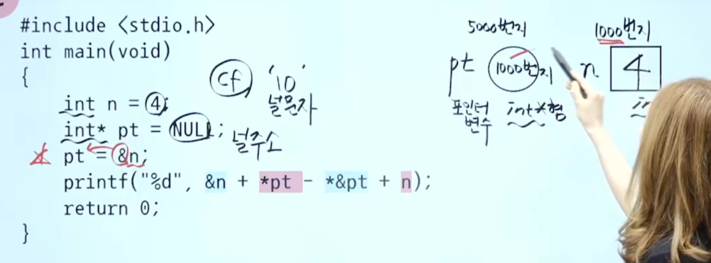
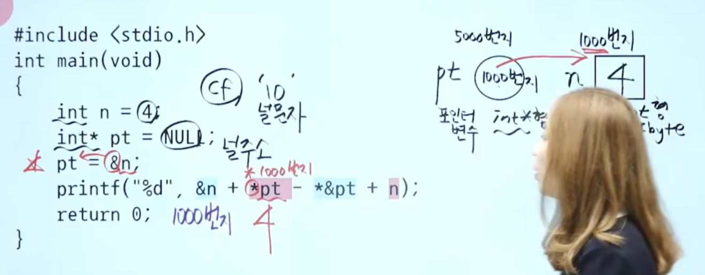
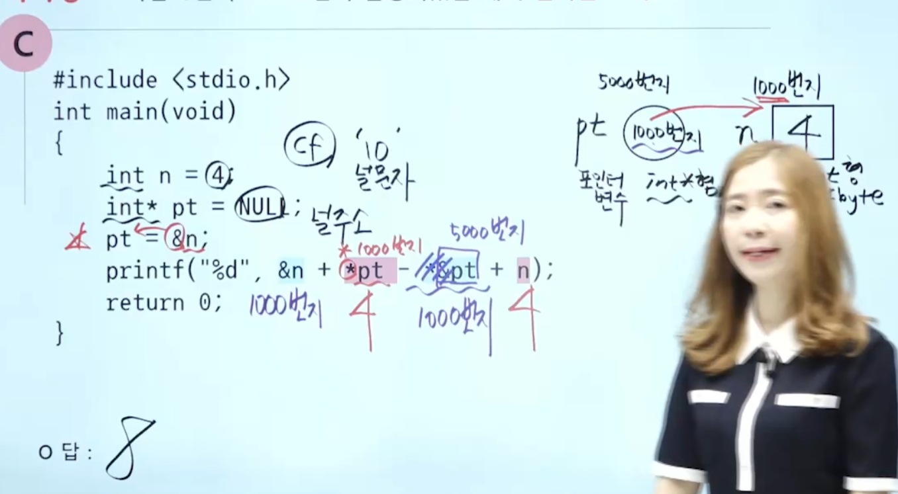

# C 언어

## && || !

```c
t1 = 5 && 3 = 1
t2 = 5 || 3 = 1
t3 = !12 = 0
printf("%d" , t1+t2+t3)
// 2
```

## 포인터

* %u 부호가없는 10진수 0에서 무한대

```c
//a[0] 주소값 10 (번지)
// int는 4바이트
//10번지 14번지 18번지 22번지
int a[] = {14,22,30,38} // a[4]
printf("%u, ", &a[2]); // &a[2]의 주소위치 = 18
printf("%u", a); // 14가 아닌 a의 주소인 10
// a == &a[0]
// 결과 18, 10
```

```c
--3 // 3
*&pt // &pt >  *1
```

* &a 주소연산자
* *p 포인터연산자 // 주소의 내용
* int* pt = NULL // 포인터변수 : 주소를 저장할수있음
* pt = &n // n의 주소를 pt에 저장
* 
* 
## if elif else

* python

```python
if x== 10 :
	print()
____ x==20: // elif
	print('')
else:
	print('')
```
