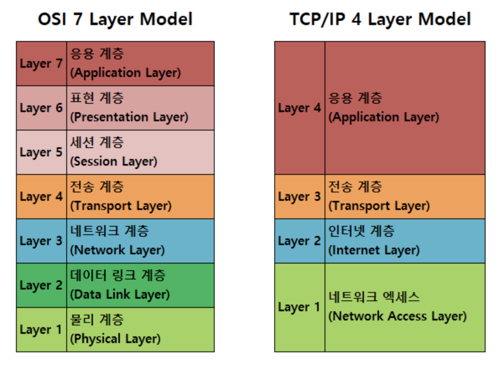
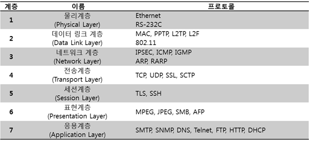

# (Computer Network) Protocol Layer

## 응용 SW 기초 기술 활용
Chapter 11 - 네트워크

## 컴퓨터 네트워크
네트워크란 원하는 정보를 원하는 수신자 , 기기에 정확하게 전송하기 위한 인프라
유, 무선 매체를 이용해 통신 장치를 연결하는 통신망

## 장점
서버를 통해 구성원간 데이터 공유를 편리하게함
공간 및 비용을 절약
중복 백업을 방지해 백업이 용이함

## 거리에 따른 네트워크 분류
LAN : 근거리 네트워크
MAN : 도시권 네트워크
WAN : 광대역 네트워크

## LAN 특징
단일 기관이나 소유 및 제한된 지역, 어떤 통신 시스템 기기와도 연결 가능, 오류 발생률이 낮으며 전송 지연을 최소화함.
종류(위상, 토폴로지)
성형(star형) : 중앙에 호스트 컴퓨터가 있고 이를 중심으로 터미널들이 연결되는 중앙 집중식 구조
링형(Ring형) : 데이터는 한쪽 방향으로만 흐르고 병목 현상이 드물지만, 두 노드 사이의 채널이 고장나면 전체 네트워크가 손상됨, 한 노드 절단되어도 다른 노드로 우회 가능
버스형(Bus) : 한 개의 통신 회선에 여러 개의 사이트가 연결된 형태
계층형(Tree) : 트리 형태, 분산 처리 시스템을 구성
망형(Mesh) : 각 사이트는 시스템 내 모든 사이트들과 직접 연결된 형태, n(n-1)/2 개의 회선 필요

## 전송 방식에 따른 분류
베이스 밴드 : 신호 변조 없이 고유 주파수 영역을 사용, 시분할 다중화 방식(TDM)을 사용, 쉽고 경제적임 
브로드밴드 :  디지털을 아날로그 신호로 광대역 변조, 주파수분할 다중화 방식(FDM)을 사용

* IEEE 802.1 : 상위 계층 인터페이스
* IEEE 802.2 : 논리 링크 제어
* IEEE 802.3 : CSMA/CD(통신 채널 상태를 파악, 통신 채널이 데이터 전송을 하지 않을 때 정보를 전송하는 방식)
* IEEE 802.4 : 토큰 버스
* IEEE 802.5 : 토큰 링
* IEEE 802.6 : MAN
* IEEE 802.8 : 고속 이더넷
* IEEE 802.11 : 무선 LAN
* IEEE 802.15 : 블루투스

## MAC(전송 매체 접근 제어)
하나의 통신 회선에 여러 대의 컴퓨터를 연결해 통신이 가능하도록
연결된 컴퓨터들이 일정한 규칙 없이 데이터를 전송할 경우 통신 회선을 공유해 데이터가 충돌함
(CSMA, CSMA/CD, 토큰 버스, 토큰 링, 토큰 패싱)

## 이더넷
가장 많이 사용하는 LAN 구축 방식

## FDDI
LAN간 트래픽 폭증 문제를 해결할 수 있는 고속 LAN

리피터 : 디지털 신호 증폭기(1계층에서 동작)
허브 : 네트워크에 연결된 회선이 모이는 접선 장치, 각 회선을 통합적으로 관리
브리지, 스위치 : 두개의 LAN이 데이터 링크 계층에서 서로 결합되어 있는 경우, 이들을 연결하는 장비, 
-스위치 : HW로 처리되어, SW적으로 프레임을 처리하는 브리지보다 빠름
포트들이 같은 속도를 지원하는데 스위치는 서로 다른 속도를 연결 기능 제공
라우터 : 서로 다른 네트워크를 상호 접속하는 3계층 장비, (3계층에서 동작), 전송 경로를 선택하고 이 경로로 데이터를 전달
게이트웨이 : 서로 다른 프로토콜을 사용하는 망 연결(전계층에서 동작)

## WAN
광범위 지역을 연결하는 네트워크
전용 회선 : 회선이 단말기 상호 간에 항상 고정, 전송 속도 빠름, 전송 오류 적음
교환 회선 : 교환기에 의해 단말기 상호 간에 연결, 전용 회선에 비해 느림(회선제어 : 경쟁 방식)

## 회선 구성 방식
점대점 : 중앙 컴퓨터와 단말기를 일대일로 연결, 성형으로 구성
다중점(멀티 드롭) : 한 개의 통신 회선에 여러 개의 단말기를 연결, 버스형으로 구성(회선제어 : 폴링과 셀렉션)
회선다중 : 여러 개의 단말기를 다중화기를 이용해 중앙 컴퓨터와 연결

## 교환 회선 방식
회선 교환 방식 - 물리적 전용선으로 데이터 전달 경로가 정해진후 동일 경로로만 전달
축적 교환 방식
- 메시지 교환 방식 : 하나의 메시지 단위로 저장, 전달방식에 의해 데이터를 교환하는 방식
- 패킷 교환 방식 : 일정 길이의 전송 단위인 패킷으로 나누어 전송(PSDN이라고함, 종류는 가상회선 방식, 데이터그램 방식)

## 인터네트워킹
각각 운영중인 네트워크를 상호 연결해 데이터 통신이 이루어지도록 하는것
LAN - WAN 연결하는 것을 의미

## 인터넷
TCP/IP 프로토콜을 기반으로 전 세계 수많은 컴퓨터와 네트워크가 연결된 광범위한 통신망
ARPNET을 기원으로 함

WWW : 하이퍼텍스트 기반을 되어 있는 HTTP 프로토콜을 이용, 웹페이지는 서버에서 정보를 제공하고 클라이언트는 웹 브라우저에서 정보를 검색하고 제공 받음
FTP : 파일 전송 프로토콜
텔넷 : 다른 컴퓨터에 로그인 하기 위해 사용하는 프로토콜, 서비스
유스넷 : 분야별 공통된 관심사를 가진 인터넷 사용자들이 서로 의견을 주고 받게 하는 서비스
아키 : 익명의 FTP 사이트에서 파일 정보를 검색할 수 있도록 하는 서비스

## 인터넷 프로토콜
패킷 교환 네트워크에서 정보를 주고 받기 위해 사용하는 프로토콜, 네트워크 계층에 속함
패킷 헤더의 IP 주소를 기반으로 패킷을 전달, 호스트의 주소 지정과 패킷 분할 및 조립 기능 담당

## IP주소
컴퓨터 및 통신장비에 부여하는 고유한 주소, 인터넷 연결된 기기간 통신을 위해 사용함

## 도메인 이름
IP주소를 사람들이 이해하기 쉬운 단어로 표현한 것
DNS : 문자로된 도메인 이름을 숫자로된 IP주소로 변환하는 시스템

## 서브넷
하나의 네트워크 주소로 여러 네트워크로 구성하는 것

## 서브넷 마스크
컴퓨터가 속한 네트워크를 나타내는 네트워크 식별자를 추출하는 것

## IPv4 vs IPv6
IPv4 : 주소를 나타내기 위해 32bit, 32bit를 8bit단위로 구분해 10진수로 표현 
IPv6 : 주소를 나타내기 위해 128bit 사용

## IPv6 유형
유니캐스트 : 1대1
멀티캐스트 : 1대M
애니캐스트 : 1대1(근접 누구나)

## IPv4에서 IPv6로 전환하는데 사용하는 전략
듀얼 스택, 터널링, 주소 변환

## OSI 7계층 주요 기능
물리 : 전기적,기계적,기능적,절차적 기능 정의(bit)
데이터 링크 : 내부 네트워크상에서 흐름, 에러 제어, 현재 노드와 다음 접근할 노드의 물리적 주소를 포함해 '프레임' 구성(프레임)
네트워크 : 논리 주소 지정, 패킷의 최적 경로를 설정 및 네트워크 연결 관리(패킷)
전송 : 외부 네트워크 종단 간의 에러 제어 및 흐름 제어(세그먼트, 데이터 그램 단위)
세션 : 회화 구성, 동기 제어, 데이터 교환 관리, 프로세스 간 연결을 확립
표현 : 코드 변환, 암호화 및 복호화, 구문 검색
응용 : 응요 프로그램 간의 네트워크 서비스

## 프로토콜
둘 이상의 컴퓨터 사이에 데이터 전송을 할 수 있도록 미리 정보의 송, 수신측에서 정해 둔 통신 규칙

## 프로토콜 기본 요소

구문, 의미, 타이밍

## 통신 프로토콜 기능

흐름 제어, 연결 제어, 오류 제어, 순서 제어, 동기화, 다중화, 주소 지정

## X.25

패킷 교환망에 대한 ITU-T의 권고안, DTE와 DCE의 인터페이스를 규정
흐름 및 오류 제어 기능 제공, 패킷형 단말기를 패킷 교환망 접속을 위한 인터페이스 프로토콜
(물리, 프레임, 패킷 계층으로 되어있음)

TCP/IP 플래그 비트 : SYN(동기), ACK, FIN(연결 정상 종료), RST(연결 즉시 종료), PSH(세그먼터 내 긴급 데이터 아닌 데이터 빨리 처리), URG(긴급 데이터 처리)

## IP

OSI 7계층의 네트워크 계층에 해당, 비신뢰성 서비를 제공
데이터그램이라는 데이터 전송 형식을 가짐
직접 전달, 간접 전달

## TCP/IP 구조(인터넷 모델 계층)

링크 계층 : 프레임 송 수신
인터넷 계층 : 주소 지정, 경로 배정
전송 계층 : 호스트 간 통신 제공
응용 계층 : 응용 프로그램 간 데이터 송수신

## 표준안 제정 기관

ISO : 국제표준화기구
ITU : 국제전기통신연합
IEC : 국제전기표준협회
IEEE : 전기전자기술자협회

## TCP/IP 구조

인터넷 계층은 패킷을 분할해 목적지로 전송하는 것을 목적으로 함
패킷 전달시 문제가 생기면 송신지 IP 주소로 ICMP를 이용해 오류 메시지를 전송
전송 계층은 도달한 패킷의 손실 여부와 패킷의 순서 등을 관장

## TCP

연결 지향형 프로토콜, 송 수신 호스트 간에 송수신할 수 있는 통로를 만들고 데이터를 전송
신뢰성 있는 연결 서비스 제공

## TCP 세그먼트

TCP를 이용해 두 종단 장치 간 송수신하는 데이터들의 단위
구성 : TCP헤더 + 데이터
캡슐화 : IP 패킷의 데이터 부분에 포함되어 저송

## UDP

비연결 지향형 프로토콜, 전송 메시지의 정확한 수신지 도착을 보장하지 않음, 오류경우 재전송을 함, 흐름 제어 기능 제공하지 않음

## UDP 데이터그램

UDP를 이용해 주고받는 메시지
구성 : UDP헤더 + 데이터

## 경로 설정(Routing)

경로 설정은 각 메시지에서 목적지까지 갈 수 있는 경로 중 한가지 경로르 설정해 주는 과정

## 라우터 기능

경로 설정 : 목적지 네트워크 정보확인후, 여러 경로를 확인, 최적 경로 결정
스위칭 : 결정된 경로에 따라 패킷을 전달

## 라우팅 프로토콜

목적지 네트워크로 가는 경로를 알아내기 위해 사용하는 프로토콜, 라우터 간에 네트워크 상태 정보를 교환하기 위해 사용
4가지 경로 설정 방식
1. 고정 경로 제어
2. 적응 경로 제어
3. 범람 경로 제어
4. 임의 경로 제어

## 라우팅 프로토콜

정적 라우팅 프로토콜 : 관리자가 목적지 네트워크 정보를 라우터에 직접 수동으로 입력
동적 라우팅 프로토콜 : 관리자가 입력하지 않고 라우터 간 정보 교환을 통해 최적 경로를 찾아 라우팅 테이블에 등록
(종류 : 거리벡터 - 목적지 네트워크로 가는 경로까지 거쳐야 하는 라우터의 순수 물리적인 거리를 이용해 최적 경로 결정, 링크 상태 - 대역폭과 지연 값 등 링크의 상태를 이용해 최적 경로 결정)

EGP : 외부 게이트 웨이 프로토콜
BGP - 외부 라우팅 프로토콜로서 AS간의 라우팅을 함, 테이블을 전달하는 데 주로 이용

IGP : 내부 게이트 웨이 프로토콜 
RIP - IP 통신망의 경로 지정 통신 규약, 경유하는 라우터의 대수의 따라 최단 경로를 동적으로 결정하는 거리벡터알고리즘 적용
OSPF - 링크 상태 라우팅 프로토콜, IP 패킷에서 프로토콜 번호 89번을 사용해 라우팅 정보를 전송하여 안정되고 다양한 기능으로 가장 많이 사용되는 IGP

https://enlqn1010.tistory.com/81